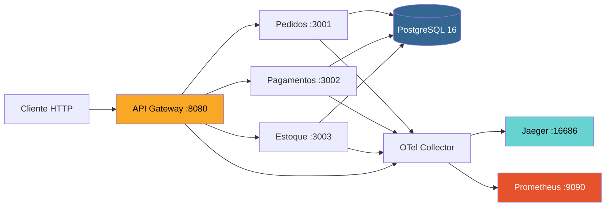
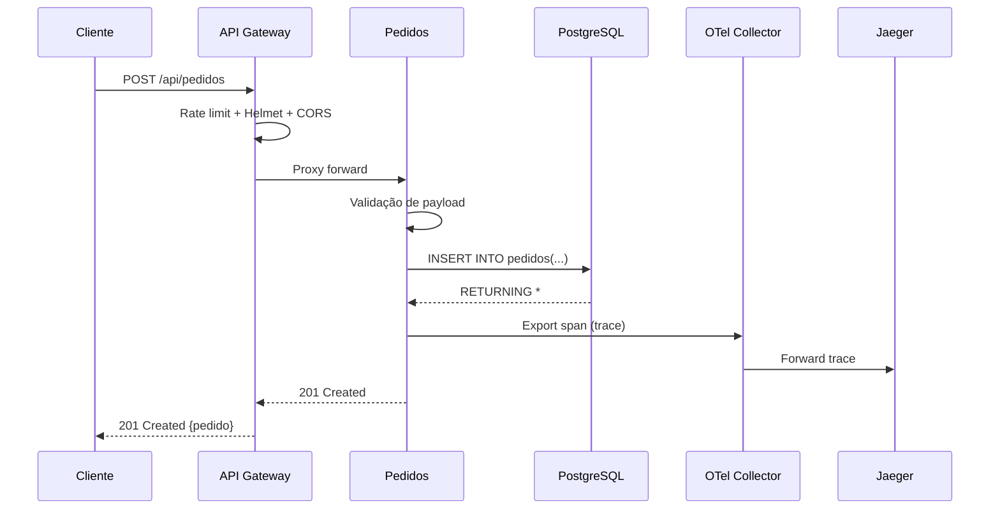
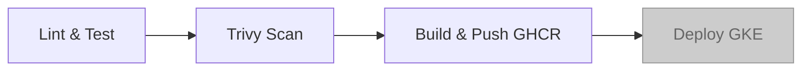
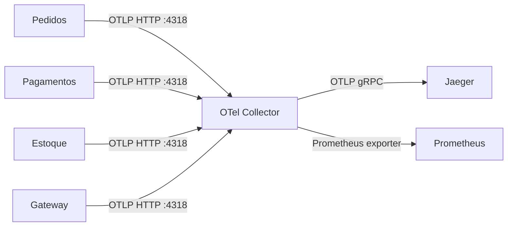

# 🚀 Pedidos Veloz


Plataforma de gerenciamento de pedidos construída com arquitetura de microsserviços.
Utiliza Docker para containerização, Kubernetes para orquestração, GitHub Actions
para CI/CD e OpenTelemetry + Prometheus + Jaeger para observabilidade completa.

---

## Sumário

- [Arquitetura](#arquitetura)
- [Stack Tecnológica](#stack-tecnológica)
- [Pré-requisitos](#pré-requisitos)
- [Quick Start](#quick-start)
- [Endpoints Disponíveis](#endpoints-disponíveis)
- [URLs Locais](#urls-locais)
- [Estrutura de Pastas](#estrutura-de-pastas)
- [Detalhamento dos Serviços](#detalhamento-dos-serviços)
- [Pipeline CI/CD](#pipeline-cicd)
- [Deploy](#deploy)
- [Observabilidade](#observabilidade)
- [Segurança](#segurança)
- [Testes](#testes)
- [Decisões Arquiteturais](#decisões-arquiteturais)
- [Contribuição](#contribuição)
- [Variáveis de Ambiente](#variáveis-de-ambiente)
- [Vídeo Pitch](#vídeo-pitch)
- [Autora](#autora)
- [Trabalho Acadêmico — UniFECAF](#trabalho-acadêmico--unifecaf)

---

## Arquitetura



### Fluxo de Requisição — Criar Pedido



---

## Stack Tecnológica

| Categoria | Tecnologia | Versão |
|-----------|-----------|--------|
| Runtime | Node.js | 20 LTS |
| Framework HTTP | Express | 4.18 |
| Banco de Dados | PostgreSQL | 16 |
| Containerização | Docker (multi-stage) | 24+ |
| Orquestração | Kubernetes (GKE) | 1.28+ |
| CI/CD | GitHub Actions | v4 |
| IaC | Terraform | 1.5+ |
| Tracing | OpenTelemetry + Jaeger | 0.46 / 1.53 |
| Métricas | Prometheus + prom-client | 2.49 / 15.1 |
| Logs | Pino (JSON estruturado) | 8.17 |
| Segurança | Helmet + Rate Limiting + Trivy | — |

---

## Pré-requisitos

| Ferramenta | Obrigatório | Uso |
|-----------|:-----------:|-----|
| Docker + Docker Compose | Sim | Ambiente local completo |
| Node.js 20+ | Sim | Testes e lint |
| kubectl | Opcional | Deploy em cluster K8s |
| Terraform 1.5+ | Opcional | Provisionamento GKE |

---

## Quick Start

```bash
git clone https://github.com/emillydesousa/pedidos-veloz.git
cd pedidos-veloz
docker compose up -d
```

Verificar saúde:

```bash
curl http://localhost:8080/health
# {"status":"ok","service":"api-gateway"}
```

Exemplos de uso:

```bash
# Criar pedido
curl -X POST http://localhost:8080/api/pedidos \
  -H "Content-Type: application/json" \
  -d '{"cliente":"João Silva","itens":[{"produto":"Pizza","qty":2}],"valor_total":59.90}'

# Listar pedidos
curl http://localhost:8080/api/pedidos

# Cadastrar produto no estoque
curl -X POST http://localhost:8080/api/estoque \
  -H "Content-Type: application/json" \
  -d '{"nome":"Pizza Margherita","sku":"PIZ-001","quantidade":50,"preco":29.90}'

# Registrar pagamento via PIX
curl -X POST http://localhost:8080/api/pagamentos \
  -H "Content-Type: application/json" \
  -d '{"pedido_id":1,"metodo":"pix","valor":59.90}'

# Confirmar pagamento
curl -X PATCH http://localhost:8080/api/pagamentos/1/confirmar

# Reservar estoque
curl -X PATCH http://localhost:8080/api/estoque/1/reservar \
  -H "Content-Type: application/json" \
  -d '{"quantidade":2}'
```

---

## Endpoints Disponíveis

### Pedidos (porta 3001)

| Método | Rota | Descrição |
|--------|------|-----------|
| GET | `/api/pedidos` | Listar pedidos (últimos 50) |
| GET | `/api/pedidos/:id` | Buscar pedido por ID |
| POST | `/api/pedidos` | Criar novo pedido |
| PATCH | `/api/pedidos/:id/status` | Atualizar status |

**Status válidos:** `pendente`, `pago`, `preparando`, `enviado`, `entregue`, `cancelado`

**Payload — criar pedido:**

```json
{
  "cliente": "João Silva",
  "itens": [{"produto": "Pizza", "qty": 2}],
  "valor_total": 59.90
}
```

### Pagamentos (porta 3002)

| Método | Rota | Descrição |
|--------|------|-----------|
| POST | `/api/pagamentos` | Registrar pagamento |
| GET | `/api/pagamentos/:pedido_id` | Listar pagamentos do pedido |
| PATCH | `/api/pagamentos/:id/confirmar` | Confirmar pagamento |

**Métodos aceitos:** `pix`, `cartao_credito`, `cartao_debito`, `boleto`

**Payload — registrar pagamento:**

```json
{
  "pedido_id": 1,
  "metodo": "pix",
  "valor": 59.90
}
```

### Estoque (porta 3003)

| Método | Rota | Descrição |
|--------|------|-----------|
| GET | `/api/estoque` | Listar produtos |
| GET | `/api/estoque/:id` | Buscar produto por ID |
| POST | `/api/estoque` | Cadastrar produto |
| PATCH | `/api/estoque/:id/reservar` | Reservar quantidade (atômico) |

**Payload — cadastrar produto:**

```json
{
  "nome": "Pizza Margherita",
  "sku": "PIZ-001",
  "quantidade": 50,
  "preco": 29.90
}
```

### Health Checks (todos os serviços)

| Método | Rota | Descrição |
|--------|------|-----------|
| GET | `/health` | Liveness — serviço está vivo |
| GET | `/ready` | Readiness — conexão com DB OK |
| GET | `/metrics` | Métricas Prometheus |

---

## URLs Locais

| Serviço | URL | Descrição |
|---------|-----|-----------|
| API Gateway | http://localhost:8080 | Ponto de entrada único |
| Pedidos | http://localhost:3001 | Acesso direto |
| Pagamentos | http://localhost:3002 | Acesso direto |
| Estoque | http://localhost:3003 | Acesso direto |
| Jaeger UI | http://localhost:16686 | Traces distribuídos |
| Prometheus | http://localhost:9090 | Métricas |
| PostgreSQL | localhost:5432 | Banco de dados |

---

## Estrutura de Pastas

```
pedidos-veloz/
├── services/
│   ├── api-gateway/             # Proxy reverso + segurança
│   │   ├── src/index.js         # Servidor Express + proxy
│   │   ├── src/tracing.js       # Instrumentação OTel
│   │   ├── Dockerfile           # Multi-stage, non-root
│   │   └── package.json
│   ├── pedidos/                 # Gestão de pedidos
│   │   ├── src/index.js         # CRUD + validações
│   │   ├── src/db.js            # Pool PostgreSQL
│   │   ├── src/tracing.js       # Instrumentação OTel
│   │   ├── __tests__/           # Testes Jest
│   │   ├── Dockerfile
│   │   └── package.json
│   ├── pagamentos/              # Processamento de pagamentos
│   │   ├── src/index.js
│   │   ├── src/db.js
│   │   ├── src/tracing.js
│   │   ├── __tests__/
│   │   ├── Dockerfile
│   │   └── package.json
│   └── estoque/                 # Controle de estoque
│       ├── src/index.js
│       ├── src/db.js
│       ├── src/tracing.js
│       ├── __tests__/
│       ├── Dockerfile
│       └── package.json
├── k8s/                         # Manifests Kubernetes
│   ├── namespace.yaml
│   ├── api-gateway/             # deployment + service + hpa
│   ├── pedidos/
│   ├── pagamentos/
│   └── estoque/
├── terraform/                   # IaC — GKE + Cloud SQL
│   ├── main.tf
│   ├── variables.tf
│   ├── outputs.tf
│   └── terraform.tfvars.example
├── infra/
│   ├── db/init/                 # Scripts de inicialização
│   │   ├── 01-create-databases.sh
│   │   └── 02-create-tables.sql
│   ├── otel/                    # OTel Collector config
│   │   └── otel-collector-config.yaml
│   └── prometheus/              # Prometheus config
│       └── prometheus.yml
├── .github/workflows/
│   └── ci-cd.yml                # Pipeline completo
├── docker-compose.yml
├── package.json                 # Workspace root
├── jest.config.js
├── .eslintrc.json
├── .env.example
├── CONTRIBUTING.md
└── README.md
```

---

## Detalhamento dos Serviços

### API Gateway

| Item | Valor |
|------|-------|
| Porta | 3000 (interna) / 8080 (docker-compose) |
| Função | Proxy reverso, rate limiting, CORS, headers de segurança |
| Dependências | pedidos, pagamentos, estoque |
| Banco | Nenhum |

Funcionalidades:
- Rate limiting: 100 requests/minuto por IP
- Helmet: headers de segurança (CSP, HSTS, X-Frame-Options)
- CORS habilitado
- Proxy transparente via `http-proxy-middleware` v3

**Variáveis de ambiente:**

| Variável | Default | Descrição |
|----------|---------|-----------|
| PORT | 3000 | Porta do servidor |
| PEDIDOS_SERVICE_URL | http://pedidos:3001 | URL do serviço de pedidos |
| PAGAMENTOS_SERVICE_URL | http://pagamentos:3002 | URL do serviço de pagamentos |
| ESTOQUE_SERVICE_URL | http://estoque:3003 | URL do serviço de estoque |
| OTEL_EXPORTER_OTLP_ENDPOINT | http://otel-collector:4318/v1/traces | Endpoint OTel |
| LOG_LEVEL | info | Nível de log |

### Pedidos

| Item | Valor |
|------|-------|
| Porta | 3001 |
| Função | CRUD de pedidos com máquina de estados |
| Banco | pedidos_db |

**Variáveis de ambiente:**

| Variável | Default | Descrição |
|----------|---------|-----------|
| PORT | 3001 | Porta do servidor |
| DB_HOST | postgres | Host do banco |
| DB_PORT | 5432 | Porta do banco |
| DB_NAME | pedidos_db | Nome do banco |
| DB_USER | pedidos_user | Usuário |
| DB_PASSWORD | pedidos_pass | Senha |
| OTEL_EXPORTER_OTLP_ENDPOINT | http://otel-collector:4318/v1/traces | Endpoint OTel |

### Pagamentos

| Item | Valor |
|------|-------|
| Porta | 3002 |
| Função | Registro e confirmação de pagamentos |
| Banco | pagamentos_db |

Métodos suportados: PIX, cartão de crédito, cartão de débito, boleto.

**Variáveis de ambiente:** mesma estrutura do serviço Pedidos, com `DB_NAME=pagamentos_db` e `DB_USER=pagamentos_user`.

### Estoque

| Item | Valor |
|------|-------|
| Porta | 3003 |
| Função | Cadastro de produtos e reserva atômica de estoque |
| Banco | estoque_db |

A reserva utiliza `UPDATE ... WHERE quantidade >= $1` para garantir atomicidade sem race conditions.

**Variáveis de ambiente:** mesma estrutura do serviço Pedidos, com `DB_NAME=estoque_db` e `DB_USER=estoque_user`.

---

## Pipeline CI/CD

Pipeline definido em `.github/workflows/ci-cd.yml`, executado em push/PR para `main`.

### Stages



> O job de **Deploy** é executado apenas quando as variáveis `GKE_CLUSTER_NAME` e `GCP_SA_KEY` estão configuradas no repositório. Caso contrário, é automaticamente ignorado (skipped).

| Stage | O que faz | Condição | Gate de qualidade |
|-------|-----------|----------|-------------------|
| **Lint & Test** | ESLint + Jest com cobertura | Sempre (push/PR) | Zero erros lint, cobertura ≥50% branches/functions |
| **Trivy Scan** | Scan de vulnerabilidades nas imagens | Após testes | Informativo (não bloqueia) |
| **Build & Push** | Build Docker, push para GHCR | Apenas `main` | Build success |
| **Deploy** | Rolling update no GKE | `main` + GKE configurado | Rollout success em 300s |

### Versionamento de Imagens

Cada imagem recebe duas tags:
- **SHA do commit** (ex: `a1b2c3d`) — identificação exata
- **latest** — conveniência para desenvolvimento

Formato: `ghcr.io/<owner>/pedidos-veloz/<serviço>:<tag>`

### Secrets Necessários

| Secret/Variable | Tipo | Descrição |
|----------------|------|-----------|
| `GITHUB_TOKEN` | Automático | Autenticação GHCR |
| `GCP_SA_KEY` | Secret | Service account JSON para GKE |
| `GKE_CLUSTER_NAME` | Variable | Nome do cluster |
| `GKE_CLUSTER_ZONE` | Variable | Zona do cluster |

### Gates de Qualidade

1. **Lint**: ESLint com regras definidas em `.eslintrc.json` — zero erros
2. **Testes**: Jest com threshold de 50% branches, 50% functions, 60% lines/statements
3. **Trivy**: Scan de imagens Docker — reporta vulnerabilidades CRITICAL/HIGH no log (informativo, não bloqueia o pipeline)
4. **Deploy**: Condicional — só executa se `GKE_CLUSTER_NAME` estiver configurado no repo

---

## Deploy

### Deploy Local (Docker Compose)

```bash
# Subir tudo
docker compose up -d

# Verificar containers
docker compose ps

# Ver logs de um serviço
docker compose logs pedidos -f

# Parar tudo
docker compose down

# Parar e remover volumes (reset completo)
docker compose down -v
```

### Deploy em Kubernetes (kubectl)

```bash
# Criar namespace
kubectl apply -f k8s/namespace.yaml

# Aplicar todos os recursos
kubectl apply -f k8s/api-gateway/
kubectl apply -f k8s/pedidos/
kubectl apply -f k8s/pagamentos/
kubectl apply -f k8s/estoque/

# Verificar rollout
kubectl rollout status deployment/api-gateway -n pedidos-veloz
kubectl rollout status deployment/pedidos -n pedidos-veloz
kubectl rollout status deployment/pagamentos -n pedidos-veloz
kubectl rollout status deployment/estoque -n pedidos-veloz

# Verificar pods e HPAs
kubectl get pods -n pedidos-veloz
kubectl get hpa -n pedidos-veloz
```

### Provisionamento com Terraform (GKE)

```bash
cd terraform
cp terraform.tfvars.example terraform.tfvars
# Editar terraform.tfvars com project_id real

terraform init
terraform plan
terraform apply
```

Recursos provisionados:
- VPC com subnets dedicadas (pods + services)
- GKE cluster com autoscaling (1-5 nodes)
- Cloud SQL PostgreSQL 16 com backup automático
- Workload Identity para autenticação segura

### Estratégia de Rollout

Todos os deployments usam **Rolling Update** com:

```yaml
strategy:
  type: RollingUpdate
  rollingUpdate:
    maxUnavailable: 0    # Zero downtime
    maxSurge: 1          # 1 pod extra durante update
```

Isso garante que sempre há pods saudáveis atendendo requests durante o deploy.

### Rollback

```bash
# Verificar histórico
kubectl rollout history deployment/pedidos -n pedidos-veloz

# Rollback para revisão anterior
kubectl rollout undo deployment/pedidos -n pedidos-veloz

# Rollback para revisão específica
kubectl rollout undo deployment/pedidos -n pedidos-veloz --to-revision=2
```

### Configuração de Secrets no K8s

Os deployments referenciam secrets via `secretKeyRef`:

```bash
# Criar secret para o serviço de pedidos
kubectl create secret generic pedidos-db-secret \
  --from-literal=host=<DB_HOST> \
  --from-literal=database=pedidos_db \
  --from-literal=username=pedidos_user \
  --from-literal=password=<SENHA_SEGURA> \
  -n pedidos-veloz
```

Repetir para `pagamentos-db-secret` e `estoque-db-secret`.

---

## Observabilidade

O projeto implementa os 3 pilares de observabilidade:

| Pilar | Ferramenta | Acesso Local |
|-------|-----------|--------------|
| Métricas | Prometheus | http://localhost:9090 |
| Traces | Jaeger (via OTel Collector) | http://localhost:16686 |
| Logs | Pino (JSON estruturado) | `docker compose logs` |

### Como Prometheus Coleta Métricas

Configuração em `infra/prometheus/prometheus.yml`:

```yaml
scrape_configs:
  - job_name: 'api-gateway'
    static_configs:
      - targets: ['api-gateway:3000']
    metrics_path: /metrics

  - job_name: 'pedidos'
    static_configs:
      - targets: ['pedidos:3001']

  - job_name: 'pagamentos'
    static_configs:
      - targets: ['pagamentos:3002']

  - job_name: 'estoque'
    static_configs:
      - targets: ['estoque:3003']
```

Cada serviço expõe métricas via `prom-client` com prefixo próprio (ex: `pedidos_`, `gateway_`).

### Como OTel Collector Encaminha Traces



O Collector recebe spans via OTLP (HTTP/gRPC), processa em batch e exporta para Jaeger e Prometheus.

### Queries Úteis no Prometheus

```promql
# 1. Total de requests por serviço (últimos 5 min)
rate(http_request_duration_seconds_count[5m])

# 2. Latência p95 do serviço de pedidos
histogram_quantile(0.95, rate(pedidos_http_request_duration_seconds_bucket[5m]))

# 3. Taxa de erros 5xx
rate(http_request_duration_seconds_count{status_code=~"5.."}[5m])

# 4. Uso de memória por serviço
process_resident_memory_bytes

# 5. Conexões ativas no pool PostgreSQL
pg_pool_size

# 6. Requests por segundo no gateway
rate(gateway_http_request_duration_seconds_count[1m])

# 7. Uptime dos serviços
process_start_time_seconds
```

### Investigando uma Falha com Traces

1. Acesse http://localhost:16686 (Jaeger UI)
2. Selecione o serviço no dropdown (ex: `pedidos`)
3. Filtre por `status=error` ou por intervalo de tempo
4. Clique no trace para ver o waterfall completo
5. Identifique qual span falhou e o erro associado
6. O `traceId` pode ser correlacionado nos logs JSON do serviço

---

## Segurança

### Containers Non-Root

Todos os Dockerfiles seguem o padrão:

```dockerfile
RUN addgroup -g 1001 -S appgroup && \
    adduser -S appuser -u 1001 -G appgroup

USER appuser
```

Nenhum container roda como root. O processo Node.js executa com UID 1001.

### Pod Security no Kubernetes

Os deployments definem `securityContext` restritivo:

```yaml
spec:
  securityContext:
    runAsNonRoot: true
    runAsUser: 1001
    fsGroup: 1001
```

Isso garante que mesmo se a imagem for comprometida, o processo não terá privilégios elevados.

### Secrets vs ConfigMaps

| Tipo | Uso | Exemplo |
|------|-----|---------|
| Secret | Dados sensíveis (senhas, tokens) | `pedidos-db-secret` |
| ConfigMap | Configurações não-sensíveis | Endpoints de serviços |

Secrets são referenciados via `secretKeyRef` nos deployments — nunca hardcoded.

### Headers de Segurança (Helmet)

O API Gateway aplica automaticamente:
- `Content-Security-Policy`
- `Strict-Transport-Security` (HSTS)
- `X-Frame-Options: SAMEORIGIN`
- `X-Content-Type-Options: nosniff`
- `X-DNS-Prefetch-Control: off`

### Rate Limiting

Configurado no gateway: 100 requests por minuto por IP. Protege contra abuso e DDoS básico.

### Scan de Vulnerabilidades

O pipeline executa **Trivy** em cada imagem Docker:
- Severidades verificadas: CRITICAL e HIGH
- Resultado exibido no log do pipeline (formato tabela)
- Modo informativo: não bloqueia o pipeline por CVEs em imagens base (Alpine/Node)
- Em produção, recomenda-se ativar `exit-code: '1'` para bloquear deploys com vulnerabilidades

### Network Policies (K8s)

Recomendação para produção — restringir comunicação entre pods:

```yaml
apiVersion: networking.k8s.io/v1
kind: NetworkPolicy
metadata:
  name: allow-gateway-only
  namespace: pedidos-veloz
spec:
  podSelector:
    matchLabels:
      app: pedidos
  ingress:
    - from:
        - podSelector:
            matchLabels:
              app: api-gateway
      ports:
        - port: 3001
```

Isso garante que apenas o gateway pode acessar os serviços internos.

---

## Testes

```bash
# Instalar dependências
npm install

# Lint
npm run lint

# Testes com cobertura
npm run test:ci
```

### Estrutura de Testes

Cada serviço possui testes em `__tests__/`:

| Serviço | Arquivo | Cobertura |
|---------|---------|-----------|
| api-gateway | `__tests__/health.test.js` | Health, ready, metrics |
| pedidos | `__tests__/pedidos.test.js` | CRUD, validações, status |
| pagamentos | `__tests__/pagamentos.test.js` | Criar, confirmar, validações |
| estoque | `__tests__/estoque.test.js` | CRUD, reserva, estoque insuficiente |

### Abordagem

- **Framework**: Jest + Supertest
- **Mocks**: Banco de dados e tracing mockados para isolamento
- **Padrão**: AAA (Arrange, Act, Assert)
- **Threshold**: 50% branches, 50% functions, 60% lines/statements
- **Exclusões**: arquivos de infraestrutura (`tracing.js`, `db.js`) excluídos da cobertura
- **Isolamento**: `app.listen()` condicional via `require.main === module` para evitar conflito de portas

---

## Decisões Arquiteturais

### Por que microsserviços?

- **Escalabilidade independente**: o serviço de pedidos pode escalar sem afetar estoque
- **Deploy independente**: atualizar pagamentos não requer redeploy do sistema inteiro
- **Isolamento de falhas**: se estoque cair, pedidos e pagamentos continuam operando
- **Ownership claro**: cada serviço tem responsabilidade única e bem definida

### Por que Kubernetes com HPA?

- **Auto-scaling**: HPA escala pods automaticamente baseado em CPU (70%) e memória (80%)
- **Self-healing**: pods que falham são recriados automaticamente
- **Service discovery**: comunicação entre serviços via DNS interno do cluster
- **Rolling updates**: zero-downtime deploys nativos

### Por que Rolling Update?

- `maxUnavailable: 0` garante que nunca há menos pods que o mínimo
- `maxSurge: 1` limita o custo de recursos extras durante deploy
- Readiness probes garantem que tráfego só vai para pods prontos
- Rollback automático se o novo pod não ficar Ready

### Por que HPA por CPU?

- Métrica universal e confiável para serviços HTTP
- Correlação direta entre requests e uso de CPU
- Simples de configurar e debugar
- Complementado por threshold de memória (80%) como safety net

### Por que OpenTelemetry?

- **Vendor-neutral**: não cria lock-in com Jaeger, Datadog ou outro
- **Auto-instrumentação**: Express e pg são instrumentados automaticamente
- **Padrão da indústria**: CNCF graduated project
- **Collector centralizado**: um ponto de configuração para exportar para múltiplos backends

### Por que PostgreSQL com banco separado por serviço?

- **Isolamento de dados**: cada serviço é dono do seu schema
- **Evolução independente**: migrações não afetam outros serviços
- **Segurança**: credenciais separadas, princípio do menor privilégio
- **Escalabilidade futura**: facilita migração para instâncias separadas se necessário

---

## Contribuição

### Padrão de Commits (Conventional Commits)

```
<tipo>(<escopo>): <descrição curta>

Tipos:
  feat:     Nova funcionalidade
  fix:      Correção de bug
  docs:     Documentação
  refactor: Refatoração sem mudança de comportamento
  test:     Adição ou correção de testes
  ci:       Mudanças no pipeline CI/CD
  chore:    Tarefas de manutenção
```

Exemplos:

```
feat(pedidos): adicionar filtro por status na listagem
fix(estoque): corrigir race condition na reserva
docs: atualizar README com novos endpoints
ci: adicionar scan SAST no pipeline
```

### Antes de Abrir um PR

```bash
# 1. Lint
npm run lint

# 2. Testes
npm run test:ci

# 3. Build das imagens (verificar Dockerfile)
docker compose build
```

### Como Adicionar um Novo Microsserviço

1. Criar pasta em `services/<nome-do-servico>/`
2. Estrutura mínima:

```
services/novo-servico/
├── src/
│   ├── index.js      # Express + rotas + health checks
│   ├── db.js         # Pool PostgreSQL (se aplicável)
│   └── tracing.js    # Instrumentação OTel
├── __tests__/
│   └── novo-servico.test.js
├── Dockerfile         # Multi-stage, non-root
└── package.json
```

3. Adicionar ao `docker-compose.yml`
4. Criar manifests K8s em `k8s/<nome-do-servico>/` (deployment, service, hpa)
5. Adicionar job no pipeline CI/CD (matrix strategy)
6. Adicionar scrape config no Prometheus
7. Atualizar este README

---

## Variáveis de Ambiente

Arquivo `.env.example` na raiz do projeto:

| Variável | Exemplo | Serviço |
|----------|---------|---------|
| PORT | 3000 | Todos |
| DB_HOST | postgres | pedidos, pagamentos, estoque |
| DB_PORT | 5432 | pedidos, pagamentos, estoque |
| DB_NAME | pedidos_db | pedidos |
| DB_USER | pedidos_user | pedidos |
| DB_PASSWORD | pedidos_pass | pedidos |
| OTEL_EXPORTER_OTLP_ENDPOINT | http://otel-collector:4318/v1/traces | Todos |
| LOG_LEVEL | info | Todos |
| PEDIDOS_SERVICE_URL | http://pedidos:3001 | api-gateway |
| PAGAMENTOS_SERVICE_URL | http://pagamentos:3002 | api-gateway |
| ESTOQUE_SERVICE_URL | http://estoque:3003 | api-gateway |

---

## Autora

**Emilly Sousa**

---

## Trabalho Acadêmico — UniFECAF

Este projeto foi desenvolvido como parte do desafio de **Cloud DevOps** da UniFECAF.
Demonstra a aplicação prática de conceitos de microsserviços, containerização,
orquestração com Kubernetes, CI/CD com GitHub Actions, infraestrutura como código
com Terraform e observabilidade com OpenTelemetry, Prometheus e Jaeger em um
cenário realista de plataforma de pedidos.
